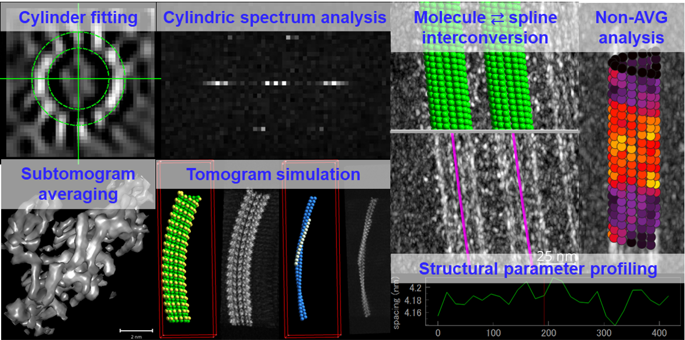

# cylindra

`cylindra` is a GUI-integrated cryo-ET image analysis tool for cylindric periodic
structures such as microtubules.



## Documentation

TODO

## Installation

- Use `pip`

```shell
pip install cylindra -U
```

- From source

If you install from the source, you'll need Rust to compile a part of the code.

```shell
git clone git+https://github.com/hanjinliu/cylindra
cd cylindra
pip install .
```

## Usage

#### Launch GUI

- From shell

  ```shell
  cylindra
  ```

- From a Python interpreter

  ```python
  from cylindra import start

  # launch a napari viewer with a cylindra dock widget.
  ui = start()
  ```

#### Command line interface

`cylindra` is implemented with some basic command line interface (CLI).

```shell
cylindra --help
```

## Implemented Functions

- Automatic/manual fitting of splines to cylindrical structures in 3D.
- Analyze lattice structures (such as lattice spacing and skew angle) using Cylindric
  Fourier transformation.
- Automatic determination of polarity, protofilament number etc.
- Monomer mapping along splines for subtomogram averaging and alignment.
- Microtubule seam search with or without binding proteins.
- Subtomogram alignment with 2D constraint.
- Tomogram simulation of cylindric structure.

## Prerequisite and Recommendations

- **Python &ge; 3.10**. This project follows [spec-0000](https://scientific-python.org/specs/spec-0000/).
- **Sufficient memory size**. Most of the intense calculations are done out-of-core
  using `dask`, so that you can even run on 8-GB memory PC in many cases. However,
  larger memory size will make parallel processing more efficient. &ge;32 GB is
  recommended.
- **Images should be loaded from SSD**. Raw image stacks are loaded lazily in most of
  the processes. Loading from HDD will slow down many analyses as well.

## Issues

If you encountered any bugs or have any requests, feel free to
[report an issue](https://github.com/hanjinliu/cylindra/issues).
(We'll appreciate if you find some methods are over-fitted to microtubules and do not
work well on other cylindric structures)

For better reproducibility, please copy your environments from `Others > cylindra info`
and the recorded macro from `Others > Macro > Show macro`.

## Citation

If you find `cylindra` useful in your work, please consider citing our paper.

```
TODO
```
