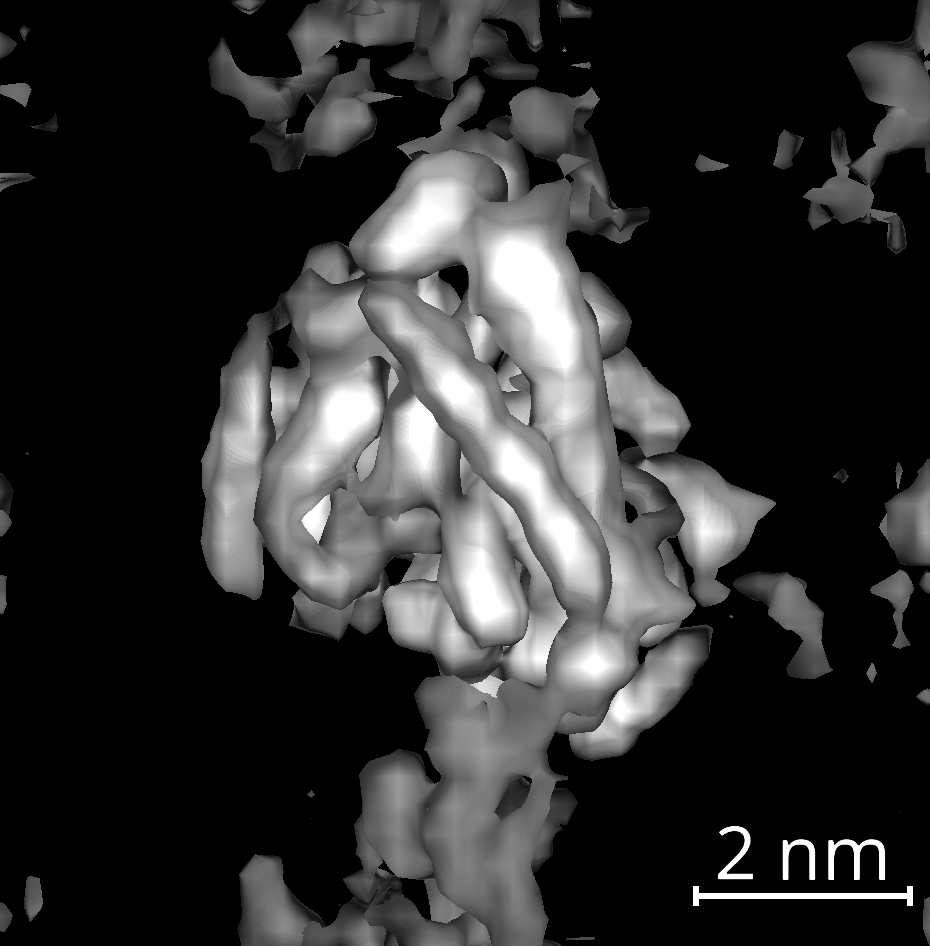

# Conventional Methods in Cryo-ET Studies

`cylindra` provides several common methods used in cryo-ET studies.

## Subtomogram Averaging

:material-arrow-right-thin-circle-outline: API: [`average_all`][cylindra.widgets.sta.SubtomogramAveraging.average_all]

:material-arrow-right-thin-circle-outline: GUI: `STA widget > Averaging > Average all molecules`

This method uses one or more molecules-layer to calculate the subtomogram average.

{ loading=lazy, width=320px }

??? info "List of parameters"
    1. Select the template image in the "template" combobox of STA widget.
    2. "layers" is the molecules layer(s) that will be averaged. If you selected
       multiple layers, all the molecules will be averaged to a single image.
    3. "size (nm)" is the size of the output image. If not given, it tries to use the
       size of the template image. It will raise an error if the size cannot be
       unambiguously determined.
    4. "interpolation" is the interpolation method used for resampling the sub-
       volumes.
    5. "bin size" is the binning factor for resampling.

After running the method, a new `napari` viewer will be opened to show the average
image. This viewer can be accessed via `ui.sta.sub_viewer`.

{ loading=lazy, width=300px }

!!! note
    There are more options for averaging molecules in the `Averaging` menu:

    - [`average_subset`][cylindra.widgets.sta.SubtomogramAveraging.average_subset]

    - [`average_groups`][cylindra.widgets.sta.SubtomogramAveraging.average_groups]

    - [`average_filtered`][cylindra.widgets.sta.SubtomogramAveraging.average_filtered]

## Subtomogram Alignment

:material-arrow-right-thin-circle-outline: API: [`align_all`][cylindra.widgets.sta.SubtomogramAveraging.align_all]

:material-arrow-right-thin-circle-outline: GUI: `STA widget > Alignment > Align all molecules`

{ loading=lazy, width=480px }

Alignment is a step in which each coordinate of a molecules layer is updated to maximize
the correlation score between the subtomogram around the molecule and the template
image. New molecules layer will be suffixed with "ALN1", "ALN2", etc.

??? info "List of parameters"
    1. Set the template image and mask parameters in the STA widget.
    2. "layers" is the molecules layer(s) that will be averaged. If you selected
       multiple layers, all the molecules will be averaged to a single image.
    3. "Max shifts (nm)" is the maximum allowed shift in (z, y, x) direction.
    4. "rotations" is the maximum allowed rotation angles in degree around each axis.
       Two `float` values are expected for each axis. `(a, b)` means the rotation
       angle will be between `-a` and `a` with step `b`. For example, `(4, 2)` means
       the rotation angles will be `-4`, `-2`, `0`, `2`, `4`.
    5. "cutoff" is the relative cutoff frequency of the low-pass filter.
    6. "interpolation" is the interpolation method used for resampling the sub-
       volumes.
    7. "method" is the method used to calculate cross correlation.
    8. "bin size" is the binning factor for resampling.

## Align Averaged Image

:material-arrow-right-thin-circle-outline: API: [`align_averaged`][cylindra.widgets.sta.SubtomogramAveraging.align_averaged]

:material-arrow-right-thin-circle-outline: GUI: `STA widget > Alignment > Align average to template`

This method is mostly used after molecules are initialized by [`map_monomers`](../molecules/spline_to_molecules.md#molecules-on-the-cylinder-surface).
It first calculates the average, then fit the average to the template image. The
optimal fitting parameters are then used to shift and rotate all the molecules. It
means that if you run `average_all` on the aligned molecules, the average image
should be *almost* well fitted to the template image.

{ loading=lazy, width=480px }

??? info "List of parameters"
    1. Select the template image and mask parameters in the STA widget. The mask is
       usually not needed, as the average image does not have much noise outside.
    2. "layers" is the molecules layer(s) that will be averaged. If you selected
       multiple layers, all the molecules will be averaged to a single image.
    3. "Max shifts (nm)" is the maximum allowed shift in (z, y, x) direction. If not
       lattice parameters will be used to infer the maximum shift, so you don't have
       to set this parameter in most cases.
    4. "rotations" is the maximum allowed rotation angles in degree around each axis.
       Two `float` values are expected for each axis. `(a, b)` means the rotation
       angle will be between `-a` and `a` with step `b`. For example, `(4, 2)` means
       the rotation angles will be `-4`, `-2`, `0`, `2`, `4`.
    5. "bin size" is the binning factor for resampling.
    6. "method" is the method used to calculate cross correlation.

## Fourier Shell Correlation (FSC)

:material-arrow-right-thin-circle-outline: API: [`calculate_fsc`][cylindra.widgets.sta.SubtomogramAveraging.calculate_fsc]

:material-arrow-right-thin-circle-outline: GUI: `STA widget > Analysis > Calculate FSC`

This method automatically split the selected molecules into two groups, and calculate
the Fourier Shell Correlation (FSC) between the two groups. The FSC curve will be shown
in the logger widget. Since the average image can easily be calculated after FSC, this
method also adds the average image to the sub-viewer as [`average_all`](#subtomogram-averaging)
does. The FSC results will also be stored in the `metadata` attribute of the image layer
for the average image.

{ loading=lazy, width=400px }

??? info "List of parameters"
    1. Set the mask parameters (and the template image if you are going to create the
       mask from the template) in the STA widget.
    2. "layers" is the molecules layer(s) that will be averaged. If you selected
       multiple layers, all the molecules will be averaged to a single image.
    3. "size (nm)" is the size of the output image. If not given, it tries to use the
       size of the template image. It will raise an error if the size cannot be
       unambiguously determined.
    4. "seed" is the random seed value used to split the molecules into two groups.
    5. "interpolation" is the interpolation method used for resampling the sub-
       volumes.
    6. You can set "number of image pairs" if you want to split molecules many times to
       get a more accurate FSC curve.
    7. Uncheck "show average" if it is not needed.
    8. "Frequency precision" will be automatically determined but you can set it
       manually.

!!! note
    If you need the two average images separately, you can run:

    :material-arrow-right-thin-circle-outline: API: [`split_and_average`][cylindra.widgets.sta.SubtomogramAveraging.split_and_average]

    :material-arrow-right-thin-circle-outline: GUI: `STA widget > Averaging > Split and average molecules`

## PCA/K-means Classification

:material-arrow-right-thin-circle-outline: API: [`classify_pca`][cylindra.widgets.sta.SubtomogramAveraging.classify_pca]

:material-arrow-right-thin-circle-outline: GUI: `STA widget > Analysis > PCA/K-means classification`

{ loading=lazy, width=400px }
