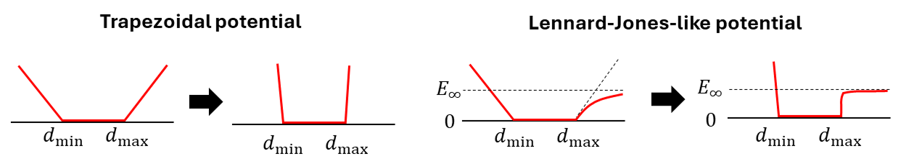

# Restricted Mesh Annealing (RMA)

Restricted Mesh Annealing (RMA) is a constrained subtomogram alignment algorithm
that was introduced in our work. It imposes longitudinal and lateral constraints
between molecules and optimize the alignment score using simulated annealing.

As an example of using RMA, see the [case study](../case_studies/rma.md).

For the longitudinal and lateral distance ranges, you can use the variable `d` to
specify the distances. `d` is a `numpy.ndarray` of shape `(N,)`, where `N` is the number
of molecules. For example, `d.mean()` is the mean distance between laterally neighboring
molecules if `d` is used in the lateral constraint.

## Run RMA on a Landscape

:material-arrow-right-thin-circle-outline: API: [`run_rma_on_landscape`][cylindra.widgets.sta.SubtomogramAveraging.run_rma_on_landscape]

:material-arrow-right-thin-circle-outline: GUI: `Subtomogram Averaging > Landscape > Run annealing (RMA)`

{ loading=lazy, width=400px }

??? info "List of Parameters"

    1. Select the landscape in the "landscape layer" combobox.
    2. "Longitudinal range (nm)" is the constrant of the longitudinal distance between
       neighboring molecules.
    3. "Lateral range (nm)" is the constrant of the lateral distance between
       neighboring molecules.
    4. "Maximum angle (deg)" is the another constraint. It is the maximum allowed
       angle between the spline tangent and the vector connecting the two molecules.
    5. "temperature time const" is the time constant of the simulated annealing. Larger
       value means slower annealing. `1.0` is usually a good value.
    6. "LJ const" is the constant of the Lennard-Jones-like potential. If greater than
       0, the annealing will use a Lennard-Jones-like potential to allow molecules to
       separate further apart than the cutoff distance.
    7. "num trials" and "seed" are the parameters for random initialization. RMA will be
       run multiple times with different random initializations, and the result with the
       best score will be selected. You can increase the number of trials to get better
       results at the cost of longer computation time.
    8. You can preview the distribution of the longitudinal/lateral distances by
       clicking the "Preview molecule network" button.

## Run RMA without Constructing a Landscape

:material-arrow-right-thin-circle-outline: API: [`align_all_rma`][cylindra.widgets.sta.SubtomogramAveraging.align_all_rma]

:material-arrow-right-thin-circle-outline: GUI: `Subtomogram Averaging > Alignment > Simulated Annealing`

{ loading=lazy, width=480px }

## Energy Potential in RMA

In RMA, negative cross-correlation scores are interpreted as the internal energy of the
system, and the neighboring molecules are constrained by the "binding energy".
Minimization of the total energy is the goal of the simulated annealing.

Modeling the binding energy is not simple. To avoid complicating the outcome, RMA does
not model the physical binding energy, but instead uses step-wise potentials:
trapozoidal potential and Lennard-Jones-like potential.

The **trapozoidal potential** can be interpreted as a hard constraint, with which the
inter-molecular distances are not allowed to exceed the minimum and maximum cutoff
distances. For example, if a microtubule is a complete cylinder, this potential gives
good alignment results.

The **Lennard-Jones-like potential** allows the inter-molecular distances to
exceed the maximum cutoff distance, but with an energy penalty $E_{\infty}$. Therefore,
molecules will be put close to each other as much as possible, but separating them
further apart does not make the entire system unstable. This potential is useful when
the microtubule is broken or flared.

Energy potentials change over time so that the binding energy outside the allowed
distance range is differentiable. This is important for the optimization process,
although simulated annealing does not strictly require the energy to be differentiable.
