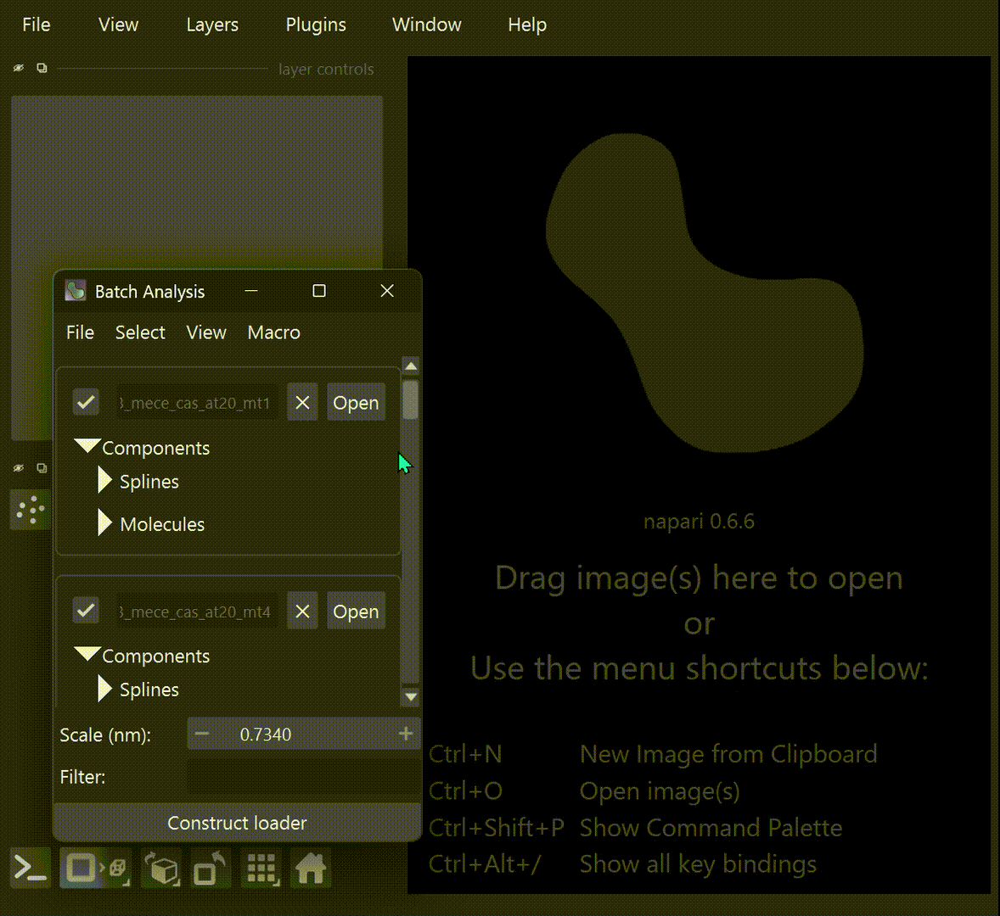

# Prepare Batch Projects

## Prepare a batch project from tomograms

:sparkles: New in v1.0.3

If you are going to analyze many tomograms, it is convenient to prepare a batch project
first. It is simply easier to manage your data with a batch project; you can open each
project one by one in the batch analyzer widget, with consistent parameters.

{ loading=lazy, width=400px }

#### Example 1: Prepare a batch project from IMOD projects

After tomogram reconstruction using IMOD, you will have directories like below:

```
data/
  ├─ TS_01/
  │   ├─ TS_01.mrc
  │   ├─ TS_01_rec.mrc
  │   └─ ...
  ├─ TS_02/
  │   ├─ TS_02.mrc
  │   ├─ TS_02_rec.mrc
  │   └─ ...
  ├─ TS_03/
  │   └─ ...
  └─ ...
```

Under the `data/` directory, first prepare a `.cylindra-defaults.toml` file to configure
the default parameters for reading each tomogram:

``` bash
cylindra prep-defaults
```

and edit the generated file:

``` bash
vim .cylindra-defaults.toml
```

Following setting means that the tomogram contrast will be inverted, 2x and 4x binned
tomograms will be calculated on loading the tomogram, and the "Lowpass" filter will be
applied to the reference image (in this case, 4x binned tomogram).

```toml title=".cylindra-defaults.toml"
invert = true
bin_size = [2, 4]
filter = "Lowpass"
```

This defaults will be referred when preparing a batch project using following command:

``` bash
cylindra prep "TS_*/*_rec.mrc" myprojects
```

This command will prepare a batch project under `myprojects/` directory, with individual
project files.

```
data/
  └─ myprojects/
      ├─ TS_01
      │   ├─ project.json
      │   └─ script.py
      ├─ TS_02
      │   ├─ project.json
      │   └─ script.py
      :
      ├─ project.json
      └─ script.py
```

!!! tip "List of patterns"

    You can pass multiple patterns separated by semicolons (`;`):

    ``` bash
    cylindra prep "project_001/TS_*/*_rec.mrc;project_002/TS_*/*_rec.mrc" myprojects
    ```

The created batch project can be opened by the following command:

```bash
cylindra open myprojects
# or
# cylindra open myprojects/project.json
```

#### Example 2: Link denoised tomograms

You may have binned and denoised tomograms already, organized like below:

```
data/
  ├─ TS_01/
  │   ├─ TS_01_rec.mrc
  │   ├─ TS_01_rec_denoised.mrc
  │   └─ ...
  ├─ TS_02/
  │   ├─ TS_02_rec.mrc
  │   ├─ TS_01_rec_denoised.mrc
  │   └─ ...
  ├─ TS_03/
  │   └─ ...
  └─ ...
```

As mentioned [here](../open_image.md#use-a-custom-reference-image), you can specify
denoised tomograms as the reference images to improve visualization and particle
picking. To link `TS_XX_rec_denoised.mrc` as the reference image of `TS_XX_rec.mrc`, set
the `image_reference` entry in the `.cylindra-defaults.toml` file like below:

```toml title=".cylindra-defaults.toml"
image_reference = "{}_denoised.mrc"
```

`{}` is the placeholder for the tomogram path without extension. This value will be
evaluated for each tomogram.

Batch project can be opened with the same command:

``` bash
cylindra prep "TS_*/*_rec.mrc" myprojects
```

#### Example 3: Prepare a batch project from existing `cylindra` projects

You can pass a pattern of existing `cylindra` project files instead of tomogram files to
the `cylindra prep` command.

``` bash
cylindra prep "projects_251029/TS_*" myprojects
```

## Make a batch project in GUI

You can make a batch project by adding existing `cylindra` projects one by one in GUI.
From the menu bar of the batch analyzer widget, click `File > Add projects`.
