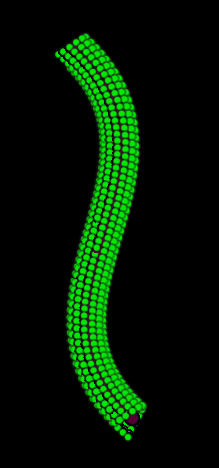

# Microtubule for Figures

Drawing a microtubule for figures (e.g., for a PowerPoint presentation) is not easy. You
usually need to carefully place tubulins so that it looks real. The z-order of tubulins
is also important but it is hard to manage.

The [simulator widget](../simulate.md) is useful for this purpose.

## Draw a spline

First, draw a spline that represents the microtubule.

- Create an empty image and draw manually

  :material-arrow-right-thin-circle-outline: API: [`create_empty_image`][cylindra.widgets.subwidgets.Simulator.create_empty_image]

  :material-arrow-right-thin-circle-outline: GUI: `Simulator widget > Create > Create empty image`

- Create an image with a straight line

  :material-arrow-right-thin-circle-outline: API: [`create_image_with_straight_line`][cylindra.widgets.subwidgets.Simulator.create_image_with_straight_line]

  :material-arrow-right-thin-circle-outline: GUI: `Simulator widget > Create > Create image with straight line`

``` python
ui.simulator.create_empty_image(size=(60.0, 80.0, 80.0), scale=0.5)
ui.register_path(coords=[[30, -157, 5], [30, -82, 30], [30, -11, 13], [30, 62, 39]])
```

## Generate tubulins

Once splines are drawn, you can [generate tubulins along the spline](../simulate.md#simulate-cylinder-with-constant-periodicity).

``` python
ui.simulator.generate_molecules(spline=0, spacing=4.08, twist=0.04, start=3, npf=13, radius=10.0)
```

You can also adjust the point size and the view mode from the layer control. In the
`napari` file menu, you can copy or save the screenshot of the current view.

{ loading=lazy, width=280px }

## Color by &alpha;- and &beta;-tubulins

Manual seam-searching can be used for coloring tubulins.

``` python
ui.sta.seam_search_manually("Mole(Sim)-0")  # assign 0 and 1 to tubulins
ui.paint_molecules("Mole(Sim)-0", color_by="isotype-id", cmap={0: "#A2A2A2", 1: "#FFE2E2"}, limits=(0, 1))
```
