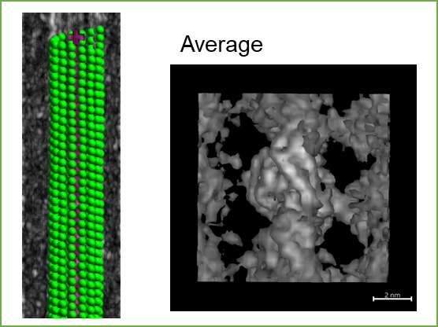

# Analyzing Microtubule Local Structures with RMA

Because RMA is a highly precise refinement process, proper initialization of the
molecule coordinates is crucial. In this section, we will show the routine for the
accurate RMA analysis.

## Step 1. Prepare molecules aligned in the pattern of the microtubule

{ loading=lazy, width=420px }

1. To properly initialize molecule coordinates on the surface of microtubules, splines
   should be precisely fitted and the lattice parameters should be determined. These
   steps are already described in the [Fit Splines](../fit_splines.md) and
   [Measure Lattice Parameters](../lattice_params.md) sections.

2. Molecules can now be mapped based on the spline curve and the determined lattice
   parameters. You can simply use the `map_monomers` method (`Molecules > From/To Splines > Map monomers`) here, as is already described in [Spline to Molecules](../molecules/spline_to_molecules.md). When you run this method, you should be careful about the
   molecules orientation (`PlusToMinus` or `MinusToPlus`). This parameter depends on the
   template images you prepared. This orientation should match the orientation of the
   template images for the later analysis.

3. Although the relative positions of the adjacent molecules are almost correct, the
   center of each molecule does not necessarily coincide with the center of the tubulin
   density in the tomogram. This is because we have not yet used the information of the
   tubulin template image in the above steps. The [Align Averaged Image](../alignment/conventional.md#align-averaged-image) section shows how to move the molecules to the
   correct positions using [`align_averaged`][cylindra.widgets.sta.SubtomogramAveraging.align_averaged] method. Success of this step can be checked by the output in the
   logger, which shows the projections of the template (green) and the average (magenta)
   images. You can further check it by subtomogram averaging of the aligned molecules.

    { loading=lazy, width=600px }

## Step 2. Refine the molecule positions by RMA

RMA can be performed by the [align_all_rma][cylindra.widgets.sta.SubtomogramAveraging.align_all_rma] method, but there are several tips to get better results.

RMA is a constrained alignment algorithm that refines the positions of the molecules
considering the constraint between longitudinal and lateral tubulin distances. If you
set the constraints too strictly or out of the range of the actual structure, results
will be highly biased. In the dialog for running RMA, you can preview the constraints
overlaid on the histogram of the intermonomer distances.

{ loading=lazy, width=320px }

Another useful way to determine the constraints is to use the distance array. In the
"longitudinal range (nm)" and "lateral range (nm)" parameter fields, you can use the
variable `d` as the distance array. This variable is an 1D `numpy.ndarray` object that
contains all the distances between the molecules. You can use `d.mean() - 0.1`, for
example, to set the lower limit of the longitudinal range to the mean distance minus
0.1 nm.

After the RMA refinement, you can see the refined positions of the molecules. the
molecules look very smooth even after the refinement using a single tubulin monomer as
the template, owing to the constraints. By averagin all the molecules, you can check if
RMA has been performed successfully.

{ loading=lazy, width=300px }

## Step 3. Calculate the local lattice structures

As the post-processing of RMA, you will usually call [`calculate_lattice_structure`][cylindra.widgets.main.CylindraMainWidget.calculate_lattice_structure] to calculate the
per-molecule lattice parameters. To denoise the estimations, you can also call
[`convolve_feature`][cylindra.widgets.main.CylindraMainWidget.convolve_feature]
to apply convolution filters to the features (similar to windowed filters on images but
considering all the connectivity between the molecules). For the visualization,
[`paint_molecules`][cylindra.widgets.main.CylindraMainWidget.paint_molecules] method is
useful to color the molecules by the feature of interest.

{ loading=lazy, width=160px }
