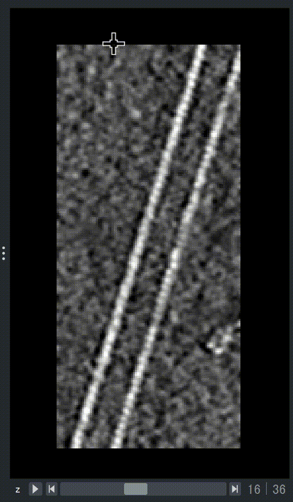
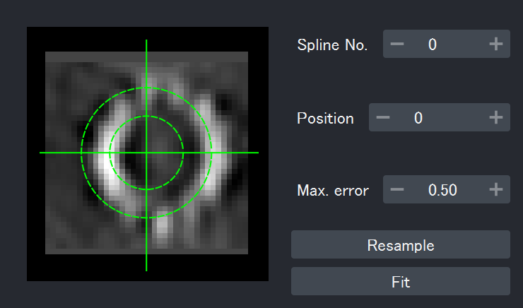

# Fit Splines

All the analysis begin with the spline fitting.

??? info "Try it out with the demo data"
    Reconstructed, binned tomograms of short microtubules are available in the
    [GitHub repository](https://github.com/hanjinliu/cylindra/blob/main/tests/13pf_MT.tif), which have been used for testing the programs. You can download it to try
    following instructions.

## Draw Splines

:material-arrow-right-thin-circle-outline: API: [`register_path`][cylindra.widgets.main.CylindraMainWidget.register_path]

:material-arrow-right-thin-circle-outline: GUI: { width=28px } or ++f1++

You can use the built-in functionality of `napari` to place points first, and fit
the points with a spline.

{ loading=lazy, width=400px }

To delete the last spline, click { width=28px }.

!!! note

    You can view the image from the different direction using the `napari` [viewer
    buttons](https://napari.org/stable/tutorials/fundamentals/viewer.html#viewer-buttons).

??? info "Auto-picking tool"

    The `cylindra` toolbar has an auto-picking tool. If you have placed two or more
    points, you can extend it with a fast auto-centering function ({ width=28px } or ++f3++).

    In the future version, other auto-picking tools (AI-powered, fully automated, etc)
    may be added.

!!! danger "Important: Configure the spline for your cylindric structure"

    Each spline is tagged with a `SplineConfig` object, which describes the average
    feature of the cylindric structure it represents. **Default values are optimized for
    microtubules**. If you want to analyze other structures, see
    [here](spline/config.md).

## Fit Automatically

Manually drawn splines usually does not fit the cylindric structure well. `cylindra`
provides some automatic spline fitting methods using template-free image alignment.

### Rough fitting

:material-arrow-right-thin-circle-outline: API: [`fit_splines`][cylindra.widgets.main.CylindraMainWidget.fit_splines]

:material-arrow-right-thin-circle-outline: GUI: `Splines > Fitting > Fit splines`

This rough spline fitting method is based on the auto-correlation first introduced in
[Blestel et al., 2009](https://ieeexplore.ieee.org/abstract/document/5193043), although
the original method only applies to 2D images. In this method, Sub-volumes are sampled
and the center of each sub-volume is estimated by the auto-correlation. Spline will try
to pass nearby the estimated centers as much as possible, while avoiding the outliers.

{ loading=lazy, width=400px }

??? info "List of parameters"

    1. The registered splines should be shown in the top "splines" row.
    2. "max interval (nm)" is the maximum distance between sampling points along the
       spline. This value does not have to be too small. The regions between sampling
       points will be interpolated by cubic functions.
    3. Available bin sizes are listed up in the "bin size" combo box.
    4. "max fit error (nm)" is the maximum distance between the estimated center of
       each sub-volume and the spline that passes nearby. Setting this value larger
       will result in more smooth splines.
    5. "degree precision" is the precision of the spline tangent angle estimation.
    6. "edge &sigma;" is the standard deviation used to mask the region outside the
       cylinder. This mask will lower the weight of the pixels outside the cylinder to
       exclude the outer components. However, if the initial spline is far from the
       actual center line, you should not mask the image.
    7. "max shift" is the maximum shift of the sampling points to the estimated center.

!!! note

    If the filament is thin, fitting to the centroid may work better. To do this, use
    following methods instead.

    :material-arrow-right-thin-circle-outline: API: [`fit_splines_by_centroid`][cylindra.widgets.main.CylindraMainWidget.fit_splines_by_centroid]

    :material-arrow-right-thin-circle-outline: GUI: `Splines > Fitting > Fit splines by centroid`

### Refine the fitting

:material-arrow-right-thin-circle-outline: API: [`refine_splines`][cylindra.widgets.main.CylindraMainWidget.refine_splines]

:material-arrow-right-thin-circle-outline: GUI: `Splines > Fitting > Refine splines`

This method is to further refine the splines after rough fitting. In this function, the
lattice helical parameters at this moment are determined by
[global-CFT analysis](lattice_params.md), and the average projection along the
spline axis is calculated. Each sub-volume along the spline is aligned to the average
to update the spline positions.

{ loading=lazy, width=400px }

??? info "List of parameters"

    1. The registered splines should be shown in the top "splines" row.
    2. "max interval (nm)" is the maximum distance between sampling points along the
       spline. This value does not have to be too small. The regions between sampling points will be interpolated by cubic functions.
    3. "max fit error (nm)" is the maximum distance between the estimated center of
       each sub-volume and the spline that passes nearby. Setting this value larger will result in more smooth splines.
    4. "correlation allowed" is the top correlation coefficients allowed to make the
       average. Setting to <1 will exclude the badly aligned sub-volumes.
    5. Available bin sizes are listed up in the "bin size" combo box.

## Fit Manually

:material-arrow-right-thin-circle-outline: GUI: `Splines > Fitting > Fit splines manually` or ++ctrl+k++ &rarr; ++ctrl+slash++

Sometimes spline fitting may fail, probably due to the poor quality of the image or the
fitting being affected by the nearby structures. In this case, you can carefully fit the
splines manually in a new window.

{ loading=lazy, width=400px }

In this window, you can left-click in the projection to select the center of the
structure. You can move along the spline by changing the "Position" box (++up++,
++down++), or go to other splines by changing the "Spline No." box (++left++,
++right++).

## The Spline Object

All the registered `Spline` objects are stored in the `ui.splines` property. It is a `list` like structure with all the registered splines as its elements.

```python
spl = ui.splines[0]  # the first Spline object
spl
```

```title="Output:"
Spline[<edge coordinates shown here>]
```

The `Spline` object has a `props` property. This object stores the local and global properties of the spline. Since we have not run any analysis yet, the properties are empty.

```python
spl.props
```

``` title="Output:"
SplineProps(
local=
shape: (0, 0)
┌┐
╞╡
└┘
global=
shape: (0, 0)
┌┐
╞╡
└┘
)
```
