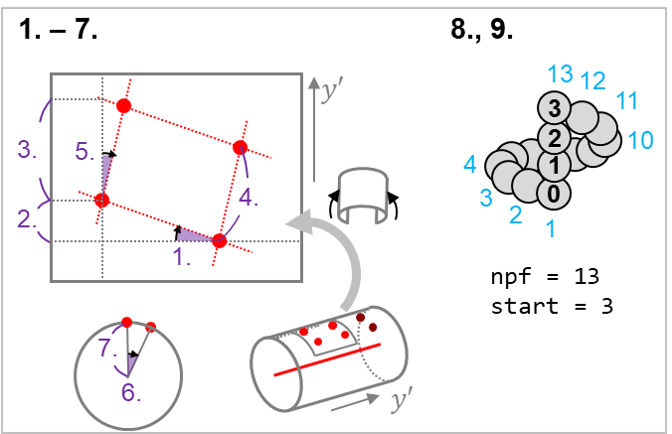

# Measure Lattice Parameters

In this section, we'll see how to measure the lattice parameters and store the results
in the `Spline` object.

## Estimate the Radius

### The global radius

:material-arrow-right-thin-circle-outline: API: [`measure_radius`][cylindra.widgets.main.CylindraMainWidget.measure_radius]

:material-arrow-right-thin-circle-outline: GUI: `Analysis > Radius > Measure radius`

To run many of the lattice analyses, you have to know the size of the cylinders.
This is the simplest method to estimate the radius using the radial profile of sampled
sub-volumes along the spline. This method should only be used if the radius is almost
constant along the cylindric structure.

{ loading=lazy, width=400px }

??? info "List of parameters"

    1. The registered splines should be shown in the top "splines" row.
    2. Available bin sizes are shown in the "bin size" combo box. Since peak detection
       is performed by calculating the centroid, scaling down does not affect a lot.
       usually ~0.5 nm/pixel is enough.
    3. "min radius" is the minimum radius to be considered as a valid peak.

After this estimation, the radius is stored as a global property of the spline. It is
available in the `spline` properties.

```python
spl = ui.splines[0]  # the first Spline object
print(spl.props.get_glob("radius"))  # print the global radius of the spline
print(spl.radius)  # a shorthand for spl.props.get_glob("radius")
```

??? info "If the estimated value is not appropriate"

    - If you forgot to invert the image, this step will be the first step that the
      result goes wrong. Make sure the image is inverted.
    - This method uses the radial profile of the raw intensity values. If the cylinder
      structure is coated with dense components inside and/or outside of the cylinder,
      the result will be affected. If there's any a priori knowledge about the radius,
      you can set it manually with [`set_radius` method](#set-global-radius-manually).

!!! note

    If the cylinder structure is supposed to change, you may want to
    [measure local radius](#the-local-radius).

### Set global radius manually

:material-arrow-right-thin-circle-outline: API: [`set_radius`][cylindra.widgets.main.CylindraMainWidget.set_radius]

:material-arrow-right-thin-circle-outline: GUI: `Analysis > Radius > Set radius`

If you already know the radius, or the rule to calculate the radius, you can set it
manually. If the latter, you'll use the [expression system](molecules/expressions.md).

{ loading=lazy, width=400px }

??? info "List of parameters"

    1. The registered splines should be shown in the top "splines" row.
    2. "radius" is the radius in nm. If a scalar is given, radii of all the selected
       splines will be updated with the same value. If an expression is given, radius
       values will be calculated by evaluating the expression using the global
       properties of the spline.

??? example "set radius using an expression"

    Calculate the radius based on the number of protofilaments.

    ```python
    ui.set_radius(splines=[0, 1], radius="col('npf') * 0.78")
    ```

    The [replace](https://docs.pola.rs/py-polars/html/reference/expressions/api/polars.Expr.replace.html)
    method is useful to map the number of protofilaments to the radius value.

    ```python
    ui.set_radius(splines=[0, 1], radius="col('npf').replace({13: 10.0, 14: 11.0})")
    ```

### The local radius

:material-arrow-right-thin-circle-outline: API: [`measure_local_radius`][cylindra.widgets.main.CylindraMainWidget.measure_local_radius]

:material-arrow-right-thin-circle-outline: GUI: `Analysis > Radius > Measure local radius`

In some cases, the radius is not constant. This method will measure the radius of each
sub-volume along the spline and store it as a local property of the spline.

{ loading=lazy, width=400px }

??? info "List of parameters"

    1. The registered splines should be shown in the top "splines" row.
    2. "interval" is the sampling interval in nm. If you already analyzed some local
       parameters, the spline should be tagged with the anchors. In this case, you can
       directly use the anchors instead of manually setting this value.
    3. "depth" is the size of sub-volumes in nm parallel to the spline.
    4. Available bin sizes are shown in the "bin size" combo box. Since peak detection
       is performed by calculating the centroid, scaling down does not affect a lot.
       usually ~0.5 nm/pixel is enough.
    5. "min radius" is the minimum radius to be considered as a valid peak.
    6. If you want to update the global property of "radius" by the mean of local
       radius, check the "Also update the global radius" checkbox.

## Infer Polarity

:material-arrow-right-thin-circle-outline: API: [`infer_polarity`][cylindra.widgets.main.CylindraMainWidget.infer_polarity]

:material-arrow-right-thin-circle-outline: GUI: `Splines > Orientation > Infer polarity`

Many biological filamentous structures have polarity. This feature usually needs to be
determined by subtomogram averaging, but in some cases we can undoubtedly distinguish
the polarity by seeing the chirality of the molecules.

In `cylindra`, an automatic polarity inference method is implemented. This method works
very well for microtubules, using the fact that clockwise appearance of tubulin
molecules corresponds to the minus-to-plus direction. Theoretically, it should also
work for other helical structures such as actin filament, but it's not guaranteed.

!!! note

    If the polarity is not inferred correctly, you can set it manually using the
    [`set_spline_props` method][cylindra.widgets.main.CylindraMainWidget.set_spline_props].

## Running CFT

CFT (cylindric Fourier Transformation) is a method introduced in our work to measure
the local and global lattice parameters of microtubules. It composed of following steps:

1. Coordinate transformation from the Cartesian coordinate $(z, y, x)$ to the
   cylindrical coordinate $(r, y', \theta)$.
2. 3D Discrete Fourier Transformation around the peak locations with up-sampling. The
   expected peak locations are defined in the spline configurations.
3. Project the 3D cylindric power spectrum to $(y', \theta)$. The peak frequencies are
   used to calculate the lattice parameters.

Note that the $y'$ coordinate is parallel to the spline in the Cartesian coordinate.
If the tilt axis of your tomogram is $y$, you should have drawn splines almost parallel
to the $y$ axis. Therefore, you can assume $y \approx y'$.

??? info "Why not FFT?"
    The FFT (Fast Fourier Transformation) is a widely used algorithm to calculate the
    Fourier Transformation very efficiently. However, FFT is not suitable for
    up-sampling because it results in a very large output image (10&times; up-sampling
    in two axes results in a 100&times; larger image). In this case, discrete Fourier
    transformation is must faster and more memory efficient.

After the radius is estimated, you can run CFT to measure the lattice parameters.

### local-CFT

:material-arrow-right-thin-circle-outline: API: [`local_cft_analysis`][cylindra.widgets.main.CylindraMainWidget.local_cft_analysis]

:material-arrow-right-thin-circle-outline: GUI: `Analysis > Local CFT analysis`

Local-CFT is a CFT analysis performed by building local cylindric coordinate systems
along the spline. The local coordinate system is "straight"; the $y'$ axis is not
curved when it's viewed in the Cartesian coordinate system.

{ loading=lazy, width=400px }

??? info "List of parameters"

    1. The registered splines should be shown in the top "splines" row.
    2. "interval" is the sampling interval in nm. You can use existing spline anchors
       if you already have ones, such as after running "Measure local radius".
    3. "depth" is the size of sub-volumes in nm parallel to the spline ($y'$ axis).
    4. Available bin sizes are shown in the "bin size" combo box. Since power spectra
       will be up-sampled, ~0.5 nm/pixel is usually enough.
    5. If you want to build local cylindric coordinate systems using the global radius,
       the "radius" parameter should be "global". Change to "local" if you'll use the
       local radius.
    6. If you want to update all the global properties, check the "Also update the
       global properties" checkbox.

After local-CFT, the spline local properties are updated. You can access them as a
`DataFrame` by:

```python
ui.splines[0].props.loc
```

``` title="Output:"
shape: (3, 8)
┌────────────┬─────────────┬──────────┬───┬─────┬───────┐
│ rise_angle ┆ rise_length ┆ pitch    ┆ … ┆ npf ┆ start │
│ ---        ┆ ---         ┆ ---      ┆   ┆ --- ┆ ---   │
│ f32        ┆ f32         ┆ f32      ┆   ┆ u8  ┆ i8    │
╞════════════╪═════════════╪══════════╪═══╪═════╪═══════╡
│ 9.999075   ┆ 0.944843    ┆ 4.099899 ┆ … ┆ 13  ┆ 3     │
│ 10.028508  ┆ 0.947809    ┆ 4.099899 ┆   ┆ 13  ┆ 3     │
│ 10.003416  ┆ 0.945541    ┆ 4.095563 ┆   ┆ 13  ┆ 3     │
└────────────┴─────────────┴──────────┴───┴─────┴───────┘
```

... or as a series:

```python
ui.splines[0].props.get_loc("rise_angle")
```

``` title="Output:"
shape: (3,)
Series: 'rise_angle' [f32]
[
	9.999075
	10.028508
	10.003416
]
```

### global-CFT

:material-arrow-right-thin-circle-outline: API: [`global_cft_analysis`][cylindra.widgets.main.CylindraMainWidget.global_cft_analysis]

:material-arrow-right-thin-circle-outline: GUI: `Analysis > Global CFT analysis`

Unlike local-CFT, global-CFT builds a distorted cylindric coordinate system; The $y'$
axis is exactly the spline. This coordinate mapping will straighten the lattice, which
makes it possible to measure the average lattice parameters.

{ loading=lazy, width=400px }

??? info "List of parameters"

    1. The registered splines should be shown in the top "splines" row.
    2. Available bin sizes are shown in the "bin size" combo box. Global-CFT uses a
       a very long region, you can use larger bin sizes.

This method will update the global properties of the spline. You can access them
similarly.

```python
ui.splines[0].props.glob
```

``` title="Output:"
┌───────────┬─────────────┬────────────┬───┬──────────┬─────┬───────┐
│ radius    ┆ orientation ┆ rise_angle ┆ … ┆ twist    ┆ npf ┆ start │
│ ---       ┆ ---         ┆ ---        ┆   ┆ ---      ┆ --- ┆ ---   │
│ f32       ┆ str         ┆ f32        ┆   ┆ f32      ┆ u8  ┆ i8    │
╞═══════════╪═════════════╪════════════╪═══╪══════════╪═════╪═══════╡
│ 11.086255 ┆ MinusToPlus ┆ 10.027519  ┆ … ┆ 0.036526 ┆ 13  ┆ 3     │
└───────────┴─────────────┴────────────┴───┴──────────┴─────┴───────┘
```

... or as a scalar:

```python
ui.splines[0].props.get_glob("rise_angle")
```

``` title="Output:"
10.027519226074219
```

## Properties of the Splines

After running CFT, splines will have the following properties:

1. `"rise_angle"`
2. `"rise_length"`
3. `"pitch"`
4. `"spacing"`
5. `"skew_angle"`
6. `"twist"`
7. `"radius"`
8. `"npf"`
9. `"start"`
10. `"orientation"` (global only)

{ loading=lazy, width=320px }

## Sweep along the Splines

After running local-CFT, you'll find the GUI being updated.

In the "Spline Control" panel, you can check the fitting results by seeing the
projections of each sub-volume along the spline.

{ loading=lazy, width=400px }

Local lattice parameters are plotted in the "Local Properties" panel. You can
interactively see the profiles in the figures.

{ loading=lazy, width=400px }

## Run this workflow easily

The "fit &rarr; refine &rarr; measure radius &rarr; CFT" workflow can be quickly run
from the toolbar, or ++f2++ key.

{ loading=lazy, width=400px }

??? info "Manually set parameters"

    :material-arrow-right-thin-circle-outline: API: [`set_spline_props`][cylindra.widgets.main.CylindraMainWidget.set_spline_props]

    :material-arrow-right-thin-circle-outline: GUI: `Splines > Set spline properties`

    This method is useful when you want to set the protofilament number, start number
    and/or orientation of the splines manually, especially when the automatic inference
    fails but you are sure about the values.
