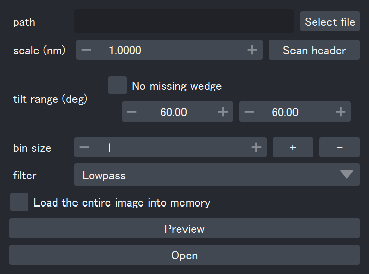
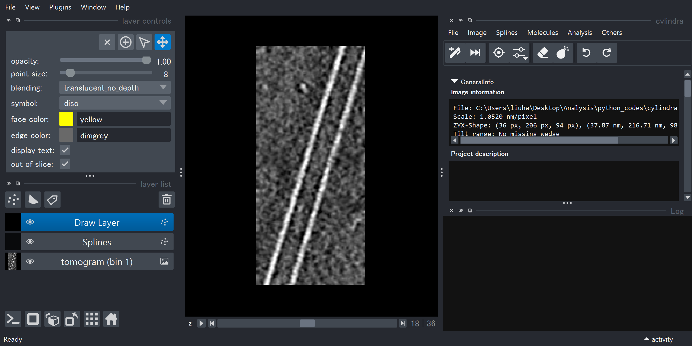

# Start Cylindra

This section describes how to start `cylindra`, open images and prepare for the
analysis.

### Launch the GUI

You can launch the GUI application using `cylindra` command.

```shell
cylindra
```

!!! note

    The `cylindra` command is enabled only when you are in the virtual environment.
    For conda users, you can activate with `conda activate my-env`

After the startup, the `napari` viewer will be shown with the `cylindra` widget added
on the right side as a dock widget.

??? info "Launch programatically"

    You can use the [`start`][cylindra.core.start] function to launch the GUI.
    The GUI object is returned.

    ```python
    from cylindra import start

    ui = start()
    ```

`napari` has a [integrate IPython console](https://napari.org/stable/tutorials/fundamentals/quick_start.html#open-an-image) for running Python code. You can open it
with ++ctrl+shift+c++. If you launched the `napari` viewer from `cylindra`, following
variables are pushed to the console global namespace:

- `ui`: The currently opened `cylindra` main GUI object.
- `viewer`: The `napari` viewer object.
- `np`: `numpy` module.
- `ip`: `impy` module.
- `pl`: `polars` module.
- `plt`: `matplotlib.pyplot` module.
- `Path`: `pathlib.Path` class.


### Open an Image

:material-arrow-right-thin-circle-outline: API: [`open_image`][cylindra.widgets.main.CylindraMainWidget.open_image].

:material-arrow-right-thin-circle-outline: GUI: `File > Open image` or ++ctrl+k++ &rarr; ++ctrl+o++.

In GUI, an open-image dialog is shown.

{ loading=lazy, width=400px }

In this dialog, you can configure how to open the image. Note that the image opened in
the viewer is **NOT the original image**. `cylindra` uses a binned and optionally
filtered image for visualization.

??? info "Open an image from IMOD or RELION project"

    If tomograms are reconstructed using IMOD or RELION, the built-in plugins can
    directly read it. See [here](extern/index.md) for more details.

??? info "If you have multiple tomograms to analyze"

    If you have multiple tomograms to analyze, you can create a batch project and use
    the batch analyzer to manage them. See [Prepare Batch Projects](batch/prep.md) for
    more details.

!!! danger "Important: Use dark background images"

    Most of the methods require dark-background images, while most of the raw images of
    electron microscopy are light-background. You have to manually prepare an inverted
    image file, or check the "Invert intensity" option in the open-image dialog. The
    loaded image can also be inverted from the menu (see [Invert Images](#invert-images)).

1. Click "Select file" to select the image file to open. tiff and mrc files are
   supported.
2. Set the appropriate pixel scale and the tilt range/axis used for calculating missing
   wedges. You can click "Scan" to fill these field automatically. To make the "Scan"
   button more clever, [prepare a `.cylindra-defaults.toml` file](#directory-specific-defaults).
3. Set the bin sizes used during your analysis. For example, setting to `[2, 4]` will
   start calculation of 2&times; and 4&times; binned images, which will be loaded into
   the memory, and leave the original image in the memory-mapped state (ready to be read
   in the future). The 4&times; binned image will be shown in the viewer as a
   reference. In the later analysis, you can switch between the original, 2&times;
   binned and 4&times; binned images. See [Use Multi-scaled Images](#use-multi-scaled-images)
   for more details.
4. Set the filter to apply to the image. The filter is applied to the reference image
   shown in the viewer, not to the original image.
5. If you want to invert the image, check "Invert intensity".
6. If you want to load the original image into the memory, check "Load the entire image
   into memory".
7. If the tomogram is stored in HDD, check "Cache image on SSD". Tomogram will be copied
   to the cache directory in SSD and automatically deleted at exit. This option will
   improve the performance a lot during your analysis.
8. You can preview the selected image by clicking "Preview". A preview window will be
   shown, which only loads separate image slices to accelerate the image loading.
9. Click "Open" to calculate the binning/filtering and show the reference image.

{ loading=lazy }

After opening an image, you'll find three layers added to the viewer:

- `"Drawing Layer"`: a [Points layer](https://napari.org/stable/howtos/layers/points.html) used to manually draw splines.
- `"Splines"`: a [Points layer](https://napari.org/stable/howtos/layers/points.html) showing the registered splines.
- `<name of the tomogram>`: an [Image layer](https://napari.org/stable/howtos/layers/image.html) showing the reference image.

The `"Drawing Layer"` will be selected, with the "add points" mode activated by default.

??? warning "Handedness since napari v0.6"

    Since v0.6, napari introduced full accessivility to the
    [axis directionality](https://napari.org/stable/guides/handedness.html), and the
    default handedness was changed from "left-handed" to "right-handed". This means that
    if you set the axis directionality to wrong parameters, tomograms and the average
    images will be flipped.
    `cylindra` will automatically change the viewer handedness to "left-handed" on
    startup, so you don't have to worry about it. However, if you find the 3D images
    flipped, you may want to [check the handedness](https://napari.org/stable/guides/handedness.html#d-data-3d-axis-orientation-and-handedness).

### Use Multi-scaled Images

Tomograms can be loaded as multi-scaled images, which means that you can switch between
the original and binned images. Many methods in `cylindra` have a `bin_size` argument.
All the bin sizes registered as multi-scales are available for this argument. Usually,
the bin sizes are set using the `bin_size` argument of the open-image dialog.

##### (i) Add a new bin size to the multi-scale list after you opened the image

:material-arrow-right-thin-circle-outline: API: [`add_multiscale`][cylindra.widgets.main.CylindraMainWidget.add_multiscale].

:material-arrow-right-thin-circle-outline: GUI: `File > Add multi-scale`

##### (ii) Choose which multi-scale image to be shown in the viewer

:material-arrow-right-thin-circle-outline: API: [`set_multiscale`][cylindra.widgets.main.CylindraMainWidget.set_multiscale].

:material-arrow-right-thin-circle-outline: GUI: `File > Set multi-scale`

It is useful when you have a low-resolution image (to see the overall state of your
sample) and a high-resolution image (to see the detailed structures of the components)
as the multi-scale images.

### Invert Images

:material-arrow-right-thin-circle-outline: API: [`invert_image`][cylindra.widgets.main.CylindraMainWidget.invert_image].

:material-arrow-right-thin-circle-outline: GUI: `Image > Invert image`

Raw images are usually light-background images, but most of the analysis methods
require dark-background images. You can invert all the images (original image, multi-
scaled images, and the reference image) using this method.

!!! note

    Since the original image is memory-mapped, the inversion will be done when the image
    is read from the memory. Therefore, it takes a bit longer in the later analysis
    compared to using an already-inverted image saved separately. They are, however, not
    that different in most cases, because the inversion is much faster than most of the
    image processing methods such as cross-correlation calculation and coordinate
    transformation.

Note that [`open_image`](#open-an-image) can also run this method by specifying the
`invert` argument.

### Use a Custom Reference Image

In some cases, you may already have a reference image for each tomogram.

- Saving binned (and filtered) images does not take much storage space. For example,
  a 4&times; binning increases the total storage size only by 1/64 = 1.6%. Directly
  using this image as the reference image will save time.
- There are many softwares that implement powerful denoising methods, such as
  [Topaz](https://github.com/tbepler/topaz), [cryoCARE](https://github.com/juglab/cryoCARE_pip) and [IsoNet](https://github.com/IsoNet-cryoET/IsoNet).
  It is a good idea to use these denoised images as the reference image while using
  the original image for the Fourier analysis and subtomogram averaging.

To use a custom reference image, check "Use user-supplied reference image" and provide
the reference path in the open-image dialog.

Alternatively, you can open a reference image after opening the tomogram using following
method.

:material-arrow-right-thin-circle-outline: API: [`open_reference_image`][cylindra.widgets.main.CylindraMainWidget.open_reference_image].

:material-arrow-right-thin-circle-outline: GUI: `File > Open reference image`

### Process the Reference Image
#### Filter the Reference Image

:material-arrow-right-thin-circle-outline: API: [`filter_reference_image`][cylindra.widgets.main.CylindraMainWidget.filter_reference_image].

:material-arrow-right-thin-circle-outline: GUI: `Image > Filter reference image`

The reference image shown in the viewer can be filtered for better visualization.
Currently, following filters are implemented:

- `method="LowPass"`: low-pass filter
- `method="Gaussian"`: Gaussian filter
- `method="DoG"`: Difference of Gaussian (DoG) filter
- `method="LoG"`: Laplacian of Gaussian (LoG) filter

Note that [`open_image`](#open-an-image) can also run this method by specifying the
`filter` argument.

#### Deconvolve the Reference Image

:material-arrow-right-thin-circle-outline: API: [`deconvolve_reference_image`][cylindra.widgets.main.CylindraMainWidget.deconvolve_reference_image].

:material-arrow-right-thin-circle-outline: GUI: `Image > Deconvolve reference image`

If you have information about the contrast transfer function (CTF) of the tomogram,
you can run Wiener deconvolution on the reference image. This will improve the quality
of the reference image much better than the filtering methods.

The implementation of this method is directly ported from [IsoNet](https://github.com/IsoNet-cryoET/IsoNet) (MIT license).

#### Saving the Reference Image

:material-arrow-right-thin-circle-outline: API: [`save_reference_image`][cylindra.widgets.main.CylindraMainWidget.save_reference_image].
:material-arrow-right-thin-circle-outline: GUI: `File > Save reference image`

The processed reference image can be saved to a file. The save path will be recorded
when the project is saved, and the reference image can directly be used when the project
is loaded. See [Load & Save Projects](project_io.md) for more details.

### Directory-specific defaults

:sparkles: New in v1.0.3

It takes time to set all the parameters in the open-image dialog every time you open a
tomogram. Since v1.0.3, you can specify directory-specific default parameters using a
`.cylindra-defaults.toml` file to make the "Scan" button more clever.

You can make a template toml file by running

```bash
cylindra prep-defaults
```

and edit the generated file. When you click the "Scan" button in the open-image dialog,
the parameters in the toml file located in the same directory or any parent directories
of the selected tomogram will be loaded as the default parameters.
