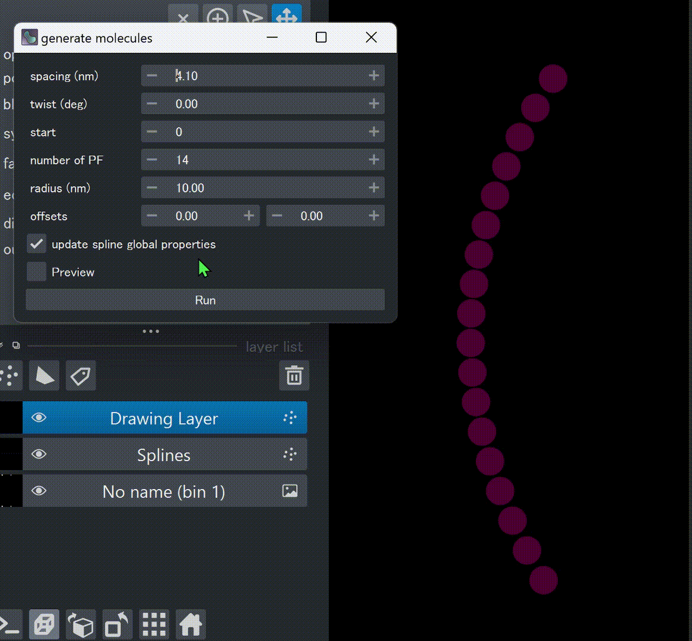

# Simulate Tomograms

`cylindra` implements several methods to simulate cylindric structures.

## Open simulator widget

:material-arrow-right-thin-circle-outline: GUI: `Image > Simulate cylindric structure` or ++ctrl+k++ &rarr; ++i++

The simulator widget is available at `ui.simulator`.

## Prepare a spline with arbitrary shape

Before running simulation, you have to place molecules at the desired positions and
orientations. To do this, you can first create an empty image, and [draw splines](fit_splines.md#draw-splines) of any shape on it.

:material-arrow-right-thin-circle-outline: API: [`create_empty_image`][cylindra.widgets.subwidgets.Simulator.create_empty_image]

:material-arrow-right-thin-circle-outline: GUI: `Simulator widget > Create > Create empty image`

{ loading=lazy, width=480px }

The image size and the pixel scale will be directly used as the simulated tomograms.

!!! note
    You can also call [mapping functions](molecules/spline_to_molecules.md) on splines
    tagged with helical parameters measured by [CFT](lattice_params.md).

## Simulate cylinder with constant periodicity

:material-arrow-right-thin-circle-outline: API: [`generate_molecules`][cylindra.widgets.subwidgets.Simulator.generate_molecules]

:material-arrow-right-thin-circle-outline: GUI: `Simulator widget >` { width=28px }

With [spline-to-molecules mapping functions](molecules/spline_to_molecules.md), the
molecules were initialized based on the helical parameters of the spline. Instead of
referring to the measured parameters, you can generate molecules along the spline with
arbitrary parameters. Following GIF shows how to adjust parameters while previewing the
result.

{ loading=lazy, width=400px }

The generated molecules will be added to the viewer with some names like `Mole(Sim)-0`.

## Apply local conformational changes to molecules

The method above can only generate molecules with constant parameters. To simulate
local conformational changes, you can use the following method. Common parameters are:

- `by`: the amount of change.
- `yrange`: the longitudinal range of the local region. `yrange=(5, 10)` means that the
  5th molecules to the 9th (end excluded!) molecules from the edge will be affected.
- `arange`: the lateral range of the local region. `arange=(2, 5)` means that the
  molecules in the 2nd to 4th (end excluded!) protofilaments will be affected.

and the preview is also available.

### Local expansion/compaction

:material-arrow-right-thin-circle-outline: API: [`expand`][cylindra.widgets.subwidgets.Simulator.expand]

:material-arrow-right-thin-circle-outline: GUI: `Simulator widget >` { width=28px }

??? example "Programatically apply local expansion"

    This script will expand the 10th to 20th molecules (all the protofilaments) from the
    tip in the layer named `"Mole(Sim)-0"` by 0.1 nm.

    ``` python
    ui.simulator.expand("Mole(Sim)-0", by=0.1, yrange=(10, 20))
    ```

### Local twisting

:material-arrow-right-thin-circle-outline: API: [`twist`][cylindra.widgets.subwidgets.Simulator.twist]

:material-arrow-right-thin-circle-outline: GUI: `Simulator widget >` { width=28px }

### Local dilation

:material-arrow-right-thin-circle-outline: API: [`dilate`][cylindra.widgets.subwidgets.Simulator.dilate]

:material-arrow-right-thin-circle-outline: GUI: `Simulator widget >` { width=28px }

### Define conformational changes by expressions

:material-arrow-right-thin-circle-outline: API: [`displace`][cylindra.widgets.subwidgets.Simulator.displace]

:material-arrow-right-thin-circle-outline: GUI: `Simulator widget >` { width=28px }

??? example "simulate supertwist"

    After [seam-searching](case_studies/seam_search.md), column "isotype-id" will be added to the
    molecules layer, which indicates the alpha/beta isotype of each molecule.

    ``` python
    dtheta = 0.05
    ui.simulator.displace(
        layer="Mole(Sim)-0",
        twist=pl.when(pl.col("isotype-id").eq(1)).then(-dtheta).otherwise(dtheta)
    )
    ```

## Asign Density to Molecules

:material-arrow-right-thin-circle-outline: API: [`add_component`][cylindra.widgets.subwidgets.Simulator.add_component]

:material-arrow-right-thin-circle-outline: GUI: `Simulator widget >` { width=28px }

!!! note
    Before this step, you can run any operations on the molecules, such as [filtration](molecules/filter_molecules.md) and [split/combine](molecules/split_and_combine.md).

Once the molecules are ready, you have to assign a template image to each molecules
layer for simulation. In this method, you can select image files and assign them to one
of the molecules layers in the viewer. The image don't have to be scaled; it will
automatically be rescaled to the pixel scale of the tomogram.

!!! warning
    If you use more than one density, they should be in the same contrast range;
    otherwise, some components will be dimmer than others.

## Simulate Tomograms from Molecules

There are several methods to simulate images from molecules.

### 1. Simulate tomograms and save as image files

:material-arrow-right-thin-circle-outline: API: [`simulate_tomogram`][cylindra.widgets.subwidgets.Simulator.simulate_tomogram]

:material-arrow-right-thin-circle-outline: GUI: `Simulator widget > Simulate > Simulate tomogram`

This method is composed of following steps:

1. **Simulate tilt series**: Tilt series images are simulated by summing all the
   projections of [registered densities](#asign-density-to-molecules). After this step,
   you will get a "perfect" tilt series.
2. **Apply CTF** *(optional)*: Contrast transfer function (CTF) is applied to the tilt
   series images, if CTF parameters are specified. If specified, the simulated CTF will
   be plotted in the logger.
3. **Add white Gaussian noise** *(optional)*: White Gaussian noise is added to the tilt
   series images. Noise is defined by noise-to-signal ratio (NSR), where the "signal" is
   the maximum intensity of the tilt series. You can specify multiple NSRs, as they use
   the same tilt series prepared in the previous steps

    ??? note "Why the maximum intensity?"
        The maximum intensity is used to normalize the noise level for consistency
        between different type of input densities. You may think of using the mean
        intensity of the input density, but it will be affected by the size of the image;
        if you padded the image with zeros, the resulting tilt series is exactly the same
        but the noise level will be different.

4. **Simulate CTF correction** *(optional)*: In the daily cryo-ET analysis, CTF
   correction is usually performed on the tilt series images. You can simulate this step
   by setting the `correct` parameter.
5. **Back-projection**: The tilt series images are back-projected to generate a
   tomogram. The height of the tomogram is automatically determined by the molecule
   coordinates and the size of the input densities.
6. **Save as image files**: The simulated tomograms are saved as image files. The
   molecules used for simulation will also be saved as a [project](project_io.md).

### 2. Simulate a tomogram and open it in the viewer

:material-arrow-right-thin-circle-outline: API: [`simulate_tomogram_and_open`][cylindra.widgets.subwidgets.Simulator.simulate_tomogram_and_open]

:material-arrow-right-thin-circle-outline: GUI: `Simulator widget > Simulate > Simulate tomogram and open`

This method is similar to the [previous one](#1-simulate-tomograms-and-save-as-image-files),
but the simulated tomogram is immediately opened in the viewer. Because only one
tomogram can be opened at a time, only one NSR can be specified.

### 3. Simulate tilt series

:material-arrow-right-thin-circle-outline: API: [`simulate_tilt_series`][cylindra.widgets.subwidgets.Simulator.simulate_tilt_series]

:material-arrow-right-thin-circle-outline: GUI: `Simulator widget > Simulate > Simulate tilt series`

This method is used to simulate tilt series images from the registered densities,
without back-projection. The simulated tilt series will be saved as an image stack.

This method is usually combined with
[the next reconstruction method](#4-simulate-tomogram-from-a-tilt-series)
to repetitively generate multiple tomograms with different settings.

### 4. Simulate tomogram from a tilt series

:material-arrow-right-thin-circle-outline: API: [`simulate_tomogram_from_tilt_series`][cylindra.widgets.subwidgets.Simulator.simulate_tomogram_from_tilt_series]

:material-arrow-right-thin-circle-outline: GUI: `Simulator widget > Simulate > Simulate tomogram from tilt series`

This method simply back-projects the tilt series images to generate a tomogram. The tilt
axis is always the y-axis. If the tilt series is generated by
[the previous method](#3-simulate-tilt-series), you can directly pass the file to this
method. If you want to use the tilt series generated outside `cylindra`, it must be
correctly aligned.
